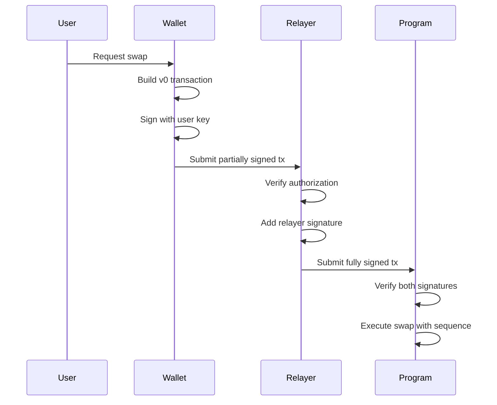

# Dual-Signing Architecture for Continuum CP-Swap

## Overview

The Continuum CP-Swap protocol implements a dual-signing mechanism to ensure that only authorized relayers can assign sequence numbers to swap orders. This prevents unauthorized parties from manipulating the FIFO queue ordering while maintaining compatibility with Solana wallets and versioned transactions.

## Architecture

### Key Components

1. **User Wallet**: Signs the transaction to authorize the swap
2. **Authorized Relayer**: Co-signs the transaction to assign the sequence number
3. **On-Chain Program**: Verifies both signatures before executing the swap
4. **Relayer Registry**: Maintains a list of authorized relayers

### Transaction Flow



## Implementation Details

### On-Chain Program

The program requires two signers for the `swap_immediate` instruction:

```rust
#[derive(Accounts)]
pub struct SwapImmediate<'info> {
    #[account(
        mut,
        seeds = [b"fifo_state"],
        bump,
        constraint = !fifo_state.emergency_pause @ ContinuumError::EmergencyPause,
    )]
    pub fifo_state: Account<'info, FifoState>,
    
    /// The relayer executing the swap - must be authorized
    #[account(
        constraint = fifo_state.authorized_relayers.contains(&relayer.key()) @ ContinuumError::UnauthorizedRelayer
    )]
    pub relayer: Signer<'info>,
    
    /// CHECK: The CP-Swap program
    pub cp_swap_program: UncheckedAccount<'info>,
    
    // Remaining accounts passed through for CP-Swap
}
```

### Relayer Authorization

Relayers must be explicitly authorized by the admin:

```rust
pub struct FifoState {
    pub current_sequence: u64,
    pub admin: Pubkey,
    pub emergency_pause: bool,
    pub authorized_relayers: Vec<Pubkey>, // List of authorized relayers
}
```

### Client-Side Transaction Building

Clients build versioned transactions (v0) that include both signers:

```typescript
// Build the swap instruction
const swapIx = await program.methods
  .swapImmediate(amountIn, minAmountOut, isBaseInput, poolId, poolAuthorityBump)
  .accountsPartial({
    fifoState: fifoState,
    relayer: relayerPublicKey, // Relayer as signer
    cpSwapProgram: CP_SWAP_PROGRAM_ID,
  })
  .remainingAccounts([...])
  .instruction();

// Create v0 transaction
const messageV0 = new TransactionMessage({
  payerKey: userWallet.publicKey,
  recentBlockhash: blockhash,
  instructions: [computeBudgetIx, swapIx],
}).compileToV0Message();

// Sign only with user wallet
const transaction = new VersionedTransaction(messageV0);
transaction.sign([userWallet]);
```

### Relayer-Side Signing

The relayer adds its signature before submission:

```typescript
// Verify relayer is included in the transaction
const relayerIndex = messageV0.staticAccountKeys.findIndex(
  key => key.equals(this.relayerWallet.publicKey)
);

if (relayerIndex === -1) {
  throw new Error('Relayer must be included as a signer in the transaction');
}

// Add relayer signature
transaction.sign([this.relayerWallet]);
```

## Wallet Adapter Integration

### Phantom/Solflare Example

```typescript
import { useWallet } from '@solana/wallet-adapter-react';
import { VersionedTransaction, TransactionMessage } from '@solana/web3.js';

export function SwapButton({ poolId, amountIn, minAmountOut }) {
  const { publicKey, signTransaction } = useWallet();
  
  const handleSwap = async () => {
    // Get relayer info
    const relayerInfo = await fetch(`${RELAYER_URL}/api/v1/info`).then(r => r.json());
    const relayerPublicKey = new PublicKey(relayerInfo.relayerAddress);
    
    // Build instruction with relayer as co-signer
    const swapIx = await buildSwapInstruction({
      userPublicKey: publicKey,
      relayerPublicKey,
      poolId,
      amountIn,
      minAmountOut,
    });
    
    // Create v0 message
    const { blockhash } = await connection.getLatestBlockhash();
    const messageV0 = new TransactionMessage({
      payerKey: publicKey,
      recentBlockhash: blockhash,
      instructions: [swapIx],
    }).compileToV0Message();
    
    // Create and sign transaction
    const transaction = new VersionedTransaction(messageV0);
    const signedTx = await signTransaction(transaction);
    
    // Submit to relayer (relayer will add its signature)
    const response = await fetch(`${RELAYER_URL}/api/v1/orders`, {
      method: 'POST',
      headers: { 'Content-Type': 'application/json' },
      body: JSON.stringify({
        transaction: Buffer.from(signedTx.serialize()).toString('base64'),
        poolId: poolId.toBase58(),
        amountIn: amountIn.toString(),
        minAmountOut: minAmountOut.toString(),
        isBaseInput: true,
        userPublicKey: publicKey.toBase58(),
      }),
    });
    
    const result = await response.json();
    console.log('Order submitted:', result.orderId);
  };
  
  return (
    <button onClick={handleSwap} disabled={!publicKey}>
      Swap Tokens
    </button>
  );
}
```

## Security Considerations

### Benefits

1. **Sequence Integrity**: Only authorized relayers can assign sequence numbers
2. **Audit Trail**: Every swap includes the relayer's signature for accountability
3. **Flexible Authorization**: Admin can add/remove relayers as needed
4. **Replay Protection**: Each transaction is unique with both signatures

### Risks and Mitigations

1. **Relayer Key Compromise**
   - Mitigation: Regular key rotation, multi-sig for critical operations
   - Emergency pause mechanism to halt operations

2. **Admin Key Security**
   - Mitigation: Use hardware wallets, multi-sig for admin operations
   - Separate keys for different environments (devnet/mainnet)

3. **Transaction Malleability**
   - Mitigation: v0 transactions with deterministic account ordering
   - Signature verification at each step

## Setup and Deployment

### 1. Deploy the Program

```bash
# Build the program
cd programs/continuum-cp-swap
anchor build

# Deploy with admin keypair
anchor deploy --provider.cluster devnet \
  --provider.wallet ~/.config/solana/admin-keypair.json
```

### 2. Initialize the Program

```bash
# Run initialization script
ts-node scripts/initialize-program.ts --admin ~/.config/solana/admin-keypair.json
```

### 3. Add Authorized Relayer

```bash
# Add relayer to whitelist
ts-node scripts/add-relayer.ts \
  --admin ~/.config/solana/admin-keypair.json \
  --relayer <RELAYER_PUBLIC_KEY>
```

### 4. Configure Relayer

Update the relayer configuration to include the program state:

```typescript
// relayer/src/config.ts
export const config = {
  continuumProgramId: 'EaeWUSam5Li1fzCcCs33oE4jCLQT4F6RJXgrPYZaoKqq',
  relayerKeypair: Keypair.fromSecretKey(...),
  // ... other config
};
```

## Testing

### Unit Tests

```bash
# Test dual-signing flow
anchor test -- --features "dual-signing"
```

### Integration Tests

```bash
# Test with real wallets
cd relayer/examples
ts-node test-dual-signing.ts
```

## Migration Guide

### For Existing Deployments

1. **Phase 1**: Deploy new program version with optional relayer signing
2. **Phase 2**: Update relayers to include signatures
3. **Phase 3**: Update clients to include relayer pubkey
4. **Phase 4**: Enable mandatory relayer signing

### For New Deployments

1. Deploy with relayer signing required from the start
2. Initialize with at least one authorized relayer
3. Ensure all clients include relayer pubkey in transactions

## Troubleshooting

### Common Issues

1. **"Unauthorized relayer" error**
   - Ensure relayer is added to the authorized list
   - Verify relayer keypair matches the added pubkey

2. **"Missing relayer signature" error**
   - Check that relayer is included in transaction accounts
   - Verify relayer service is configured correctly

3. **Wallet signing issues**
   - Ensure using versioned transactions (v0)
   - Check wallet adapter supports versioned transactions

### Debug Commands

```bash
# Check authorized relayers
ts-node scripts/check-relayers.ts

# Verify transaction structure
ts-node scripts/debug-transaction.ts --tx <TRANSACTION_BASE64>

# Test relayer signing
ts-node scripts/test-relayer-sign.ts
```

## API Reference

### Program Instructions

#### add_relayer
Adds a new authorized relayer (admin only)

```rust
pub fn add_relayer(ctx: Context<AddRelayer>) -> Result<()>
```

#### remove_relayer
Removes an authorized relayer (admin only)

```rust
pub fn remove_relayer(ctx: Context<RemoveRelayer>) -> Result<()>
```

#### swap_immediate
Executes a swap with relayer co-signature

```rust
pub fn swap_immediate(
    ctx: Context<SwapImmediate>,
    amount_in: u64,
    min_amount_out: u64,
    is_base_input: bool,
    pool_id: Pubkey,
    pool_authority_bump: u8,
) -> Result<()>
```

### Relayer Endpoints

#### GET /api/v1/info
Returns relayer information including public key

```json
{
  "relayerAddress": "GsV1jugD8ftfWBYNykA9SLK2V4mQqUW2sLop8MAfjVRq",
  "continuumProgram": "EaeWUSam5Li1fzCcCs33oE4jCLQT4F6RJXgrPYZaoKqq",
  // ...
}
```

#### POST /api/v1/orders
Submits a partially signed transaction

```json
{
  "transaction": "base64_encoded_partial_signed_tx",
  "poolId": "9AJUf9ZQ2sWq93ose12BePBn4sq36cyqE98MiZraFLJT",
  "amountIn": "1000000",
  "minAmountOut": "0",
  "isBaseInput": true,
  "userPublicKey": "7hfmvnjUJmWTJtBdK9jN92XhhoqGXH2pEbK4S6KDuZUA"
}
```

## Conclusion

The dual-signing mechanism provides a robust solution for maintaining sequence integrity in the Continuum CP-Swap protocol while remaining compatible with standard Solana wallets and transaction formats. By requiring both user and relayer signatures, the system ensures that only authorized parties can assign sequence numbers while users maintain full control over their swap authorizations.